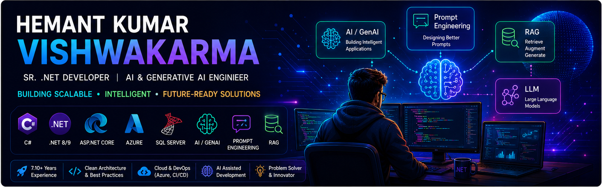

<!--# HKV507-->
Hi, I am Hemant Kumar Vishwakarma

  

<h1 align="center">
  Hi 👋, I'm Hemant Kumar Vishwakarma
</h1>

<h3 align="center">
  Senior .NET Developer | Generative AI Engineer
</h3>

  C# • .NET Core • ASP.NET Core • TypeScript • JavaScript • JQuery • Oracle • mySQL • SQL Server • Azure • Python • Prompt Engineering • Generative AI

---

## 👨‍💻 About Me

- 💻 Senior Software Engineer
- 🚀 Experienced in ASP.NET Core and C#
- ☁️ Working with Microsoft Azure
- 🤖 Learning Generative AI and LLM Engineering
- 🔎 Interested in RAG and AI Agents
- 🌱 Currently improving my AI engineering skills

---

## 🛠️ Technologies & Tools

  

---

<h2>🚀 Languages, Frameworks, Cloud & AI Tools</h2>

  <!-- Languages -->
  

  <!-- .NET / Web -->
  

  <!-- Databases -->
  

  <!-- Cloud / DevOps -->
  

<h3>🤖 AI / Generative AI</h3>

  

  

  

  

  

<h3>🧠 AI-Assisted Development</h3>

  

  

  

  

  

<h3>☁️ Cloud, DevOps & Integration</h3>

  

  

  

  

---

## 📊 GitHub Stats

  

---

## 🔥 GitHub Streak

  

---

## 🤝 Connect With Me

  <a href="YOUR_LINKEDIN">
    LinkedIn
  </a>
  |
  <a href="https://github.com/HKV507/hemantvishwakarma">
    Portfolio
  </a>

